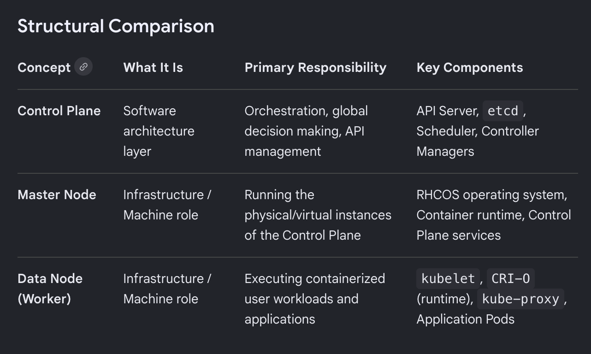
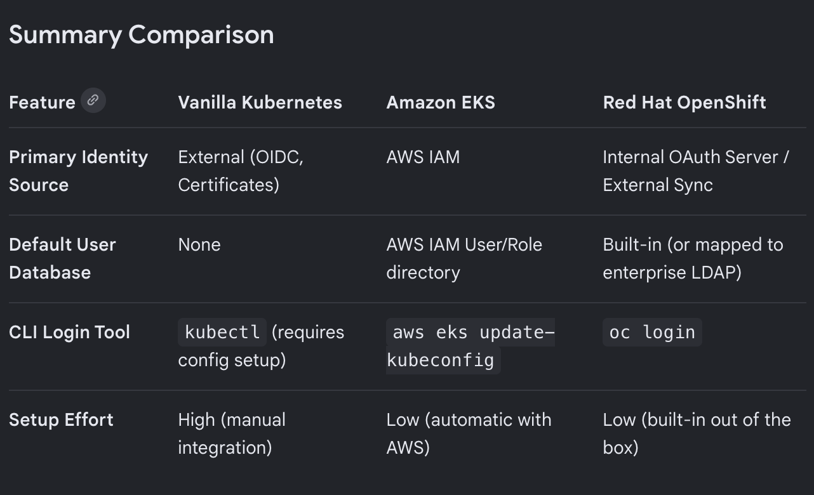
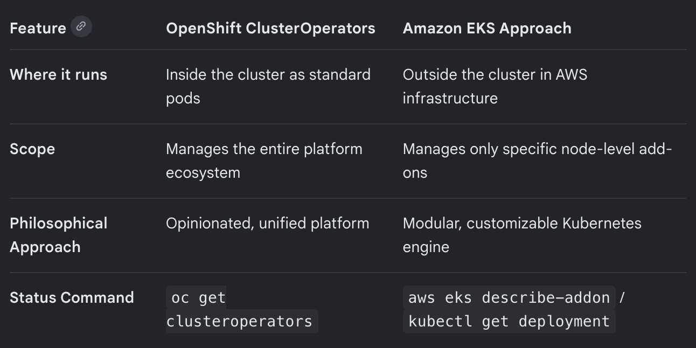

## Openshift Single Node Checks

Running openshift single node.

Current cluster version

```sh
~$ oc get clusterversion
NAME      VERSION   AVAILABLE   PROGRESSING   SINCE   STATUS
version   4.21.14   True        False         40d     Cluster version is 4.21.14
```

Nodes on the cluster

```sh
~$ oc get nodes
NAME   STATUS   ROLES                         AGE   VERSION
crc    Ready    control-plane,master,worker   40d   v1.34.6
```



### Builtin Operators

```sh
~$ oc get clusteroperators
NAME                                       VERSION   AVAILABLE   PROGRESSING   DEGRADED   SINCE   MESSAGE
authentication                             4.21.14   True        False         False      2m27s
config-operator                            4.21.14   True        False         False      40d
console                                    4.21.14   True        False         False      3m2s
control-plane-machine-set                  4.21.14   True        False         False      40d
dns                                        4.21.14   True        False         False      4m15s
etcd                                       4.21.14   True        False         False      40d
image-registry                             4.21.14   True        False         False      3m15s
ingress                                    4.21.14   True        False         False      40d
kube-apiserver                             4.21.14   True        False         False      40d
kube-controller-manager                    4.21.14   True        False         False      40d
kube-scheduler                             4.21.14   True        False         False      40d
kube-storage-version-migrator              4.21.14   True        False         False      2d18h
machine-api                                4.21.14   True        False         False      40d
machine-approver                           4.21.14   True        False         False      40d
machine-config                             4.21.14   True        False         False      40d
marketplace                                4.21.14   True        False         False      40d
network                                    4.21.14   True        False         False      40d
openshift-apiserver                        4.21.14   True        False         False      4m8s
openshift-controller-manager               4.21.14   True        False         False      35h
openshift-samples                          4.21.14   True        False         False      40d
operator-lifecycle-manager                 4.21.14   True        False         False      40d
operator-lifecycle-manager-catalog         4.21.14   True        False         False      40d
operator-lifecycle-manager-packageserver   4.21.14   True        False         False      4m17s
service-ca                                 4.21.14   True        False         False      40d
```

### Builtin Projects

In OpenShift cluster, a project is a wrapper around kubernetes namespace that provides dedicated, isolated environment to manage applications securely without interfering with others in same cluster.

```sh
oc get projects
NAME                                               DISPLAY NAME   STATUS
default                                                           Active
hostpath-provisioner                                              Active
kube-node-lease                                                   Active
kube-public                                                       Active
kube-system                                                       Active
openshift                                                         Active
openshift-apiserver                                               Active
openshift-apiserver-operator                                      Active
openshift-authentication                                          Active
openshift-authentication-operator                                 Active
openshift-cloud-network-config-controller                         Active
openshift-cloud-platform-infra                                    Active
openshift-cluster-machine-approver                                Active
openshift-cluster-samples-operator                                Active
openshift-cluster-storage-operator                                Active
openshift-cluster-version                                         Active
openshift-config                                                  Active
openshift-config-managed                                          Active
openshift-config-operator                                         Active
openshift-console                                                 Active
openshift-console-operator                                        Active
openshift-console-user-settings                                   Active
openshift-controller-manager                                      Active
openshift-controller-manager-operator                             Active
openshift-dns                                                     Active
openshift-dns-operator                                            Active
openshift-etcd                                                    Active
openshift-etcd-operator                                           Active
openshift-host-network                                            Active
openshift-image-registry                                          Active
openshift-infra                                                   Active
openshift-ingress                                                 Active
openshift-ingress-canary                                          Active
openshift-ingress-operator                                        Active
openshift-kni-infra                                               Active
openshift-kube-apiserver                                          Active
openshift-kube-apiserver-operator                                 Active
openshift-kube-controller-manager                                 Active
openshift-kube-controller-manager-operator                        Active
openshift-kube-scheduler                                          Active
openshift-kube-scheduler-operator                                 Active
openshift-kube-storage-version-migrator                           Active
openshift-kube-storage-version-migrator-operator                  Active
openshift-machine-api                                             Active
openshift-machine-config-operator                                 Active
openshift-marketplace                                             Active
openshift-monitoring                                              Active
openshift-multus                                                  Active
openshift-network-console                                         Active
openshift-network-diagnostics                                     Active
openshift-network-node-identity                                   Active
openshift-network-operator                                        Active
openshift-node                                                    Active
openshift-nutanix-infra                                           Active
openshift-oauth-apiserver                                         Active
openshift-openstack-infra                                         Active
openshift-operator-lifecycle-manager                              Active
openshift-operators                                               Active
openshift-ovirt-infra                                             Active
openshift-ovn-kubernetes                                          Active
openshift-route-controller-manager                                Active
openshift-service-ca                                              Active
openshift-service-ca-operator                                     Active
openshift-user-workload-monitoring                                Active
openshift-vsphere-infra                                           Active
```

Check all resources in a project

```sh
~$ oc get all -n openshift-monitoring
Warning: apps.openshift.io/v1 DeploymentConfig is deprecated in v4.14+, unavailable in v4.10000+
NAME                                  TYPE        CLUSTER-IP   EXTERNAL-IP   PORT(S)    AGE
service/cluster-monitoring-operator   ClusterIP   None         <none>        8443/TCP   40d
```

Check logs a pod in a project

```sh
~$ oc logs -n openshift-apiserver-operator openshift-apiserver-operator-5b468957f6-8556p --tail 10
I0623 07:06:01.589411       1 event.go:377] Event(v1.ObjectReference{Kind:"Deployment", Namespace:"openshift-apiserver-operator", Name:"openshift-apiserver-operator", UID:"5154e49e-ad14-4d41-a50b-d9dac6a4558b", APIVersion:"apps/v1", ResourceVersion:"", FieldPath:""}): type: 'Normal' reason: 'OperatorStatusChanged' Status for clusteroperator/openshift-apiserver changed: Degraded message changed from "APIServerDeploymentDegraded: 1 of 1 requested instances are unavailable for apiserver.openshift-apiserver (container is crashlooping in apiserver-978c8758d-8rxpj pod)" to "All is well",Available message changed from "APIServerDeploymentAvailable: no apiserver.openshift-apiserver pods available on any node.\nAPIServicesAvailable: apiservices.apiregistration.k8s.io/v1.apps.openshift.io: not available: endpointslices for service/api in \"openshift-apiserver\" have no addresses with port name \"https\"\nAPIServicesAvailable: apiservices.apiregistration.k8s.io/v1.authorization.openshift.io: not available: endpointslices for service/api in \"openshift-apiserver\" have no addresses with port name \"https\"" to "APIServicesAvailable: apiservices.apiregistration.k8s.io/v1.apps.openshift.io: not available: endpointslices for service/api in \"openshift-apiserver\" have no addresses with port name \"https\"\nAPIServicesAvailable: apiservices.apiregistration.k8s.io/v1.authorization.openshift.io: not available: endpointslices for service/api in \"openshift-apiserver\" have no addresses with port name \"https\""
I0623 07:06:02.227702       1 status_controller.go:230] clusteroperator/openshift-apiserver diff {"status":{"conditions":[{"lastTransitionTime":"2026-06-20T12:32:14Z","message":"All is well","reason":"AsExpected","status":"False","type":"Degraded"},{"lastTransitionTime":"2026-05-14T17:17:58Z","message":"All is well","reason":"AsExpected","status":"False","type":"Progressing"},{"lastTransitionTime":"2026-06-23T07:06:02Z","message":"All is well","reason":"AsExpected","status":"True","type":"Available"},{"lastTransitionTime":"2026-05-13T16:11:56Z","message":"All is well","reason":"AsExpected","status":"True","type":"Upgradeable"},{"lastTransitionTime":"2026-05-13T16:11:55Z","reason":"NoData","status":"Unknown","type":"EvaluationConditionsDetected"}]}}
I0623 07:06:02.258347       1 event.go:377] Event(v1.ObjectReference{Kind:"Deployment", Namespace:"openshift-apiserver-operator", Name:"openshift-apiserver-operator", UID:"5154e49e-ad14-4d41-a50b-d9dac6a4558b", APIVersion:"apps/v1", ResourceVersion:"", FieldPath:""}): type: 'Normal' reason: 'OperatorStatusChanged' Status for clusteroperator/openshift-apiserver changed: Available changed from False to True ("All is well")
I0623 07:11:57.289822       1 warnings.go:110] "Warning: v1 Endpoints is deprecated in v1.33+; use discovery.k8s.io/v1 EndpointSlice"
I0623 07:13:14.450788       1 warnings.go:110] "Warning: v1 Endpoints is deprecated in v1.33+; use discovery.k8s.io/v1 EndpointSlice"
I0623 07:14:54.527520       1 warnings.go:110] "Warning: v1 Endpoints is deprecated in v1.33+; use discovery.k8s.io/v1 EndpointSlice"
I0623 07:17:39.289651       1 warnings.go:110] "Warning: v1 Endpoints is deprecated in v1.33+; use discovery.k8s.io/v1 EndpointSlice"
I0623 07:20:24.453109       1 warnings.go:110] "Warning: v1 Endpoints is deprecated in v1.33+; use discovery.k8s.io/v1 EndpointSlice"
I0623 07:22:53.529425       1 warnings.go:110] "Warning: v1 Endpoints is deprecated in v1.33+; use discovery.k8s.io/v1 EndpointSlice"
I0623 07:24:07.310116       1 warnings.go:110] "Warning: v1 Endpoints is deprecated in v1.33+; use discovery.k8s.io/v1 EndpointSlice"
```

Describe a pod

```sh
~$ oc describe pod -n openshift-apiserver-operator openshift-apiserver-operator
Name:                 openshift-apiserver-operator-5b468957f6-8556p
Namespace:            openshift-apiserver-operator
Priority:             2000000000
Priority Class Name:  system-cluster-critical
Service Account:      openshift-apiserver-operator
Node:                 crc/192.168.126.11
Start Time:           Sat, 20 Jun 2026 12:31:26 +0000
Labels:               app=openshift-apiserver-operator
                      pod-template-hash=5b468957f6
Annotations:          k8s.ovn.org/pod-networks:
                        {"default":{"ip_addresses":["10.217.0.20/23"],"mac_address":"0a:58:0a:d9:00:14","gateway_ips":["10.217.0.1"],"routes":[{"dest":"10.217.0.0...
                      k8s.v1.cni.cncf.io/network-status:
                        [{
                            "name": "ovn-kubernetes",
                            "interface": "eth0",
                            "ips": [
                                "10.217.0.20"
                            ],
                            "mac": "0a:58:0a:d9:00:14",
                            "default": true,
                            "dns": {}
                        }]
                      openshift.io/required-scc: nonroot-v2
                      openshift.io/scc: nonroot-v2
                      seccomp.security.alpha.kubernetes.io/pod: runtime/default
                      security.openshift.io/validated-scc-subject-type: serviceaccount
Status:               Running
SeccompProfile:       RuntimeDefault
IP:                   10.217.0.20
IPs:
  IP:           10.217.0.20
Controlled By:  ReplicaSet/openshift-apiserver-operator-5b468957f6
Containers:
  openshift-apiserver-operator:
    Container ID:  cri-o://eb65ed26c378bd919b3acb6b25a42db148b14dc68079d983a87181cb821a2171
    Image:         quay.io/openshift-release-dev/ocp-v4.0-art-dev@sha256:2172de57be5d1e4596ea32d557c6851cc3d5207049f0bd852f7883d527476890
    Image ID:      quay.io/openshift-release-dev/ocp-v4.0-art-dev@sha256:2172de57be5d1e4596ea32d557c6851cc3d5207049f0bd852f7883d527476890
    Port:          8443/TCP (metrics)
    Host Port:     0/TCP (metrics)
    Command:
      cluster-openshift-apiserver-operator
      operator
    Args:
      --config=/var/run/configmaps/config/config.yaml
    State:          Running
      Started:      Tue, 23 Jun 2026 07:05:30 +0000
    Ready:          True
    Restart Count:  3
    Requests:
      cpu:     10m
      memory:  50Mi
    Environment:
      IMAGE:                          quay.io/openshift-release-dev/ocp-v4.0-art-dev@sha256:5f2841c5a06f7ed70a0018fea1a5ffd7637d6106ef19730144bd9b82904dd5c0
      OPERATOR_IMAGE:                 quay.io/openshift-release-dev/ocp-v4.0-art-dev@sha256:2172de57be5d1e4596ea32d557c6851cc3d5207049f0bd852f7883d527476890
      OPERATOR_IMAGE_VERSION:         4.21.14
      OPERAND_IMAGE_VERSION:          4.21.14
      KUBE_APISERVER_OPERATOR_IMAGE:  quay.io/crcont/openshift-crc-cluster-kube-apiserver-operator@sha256:b4dc099c13aef16df8b7f22401087bfb9443b15f6d95d7624d7e0118e582ffec
    Mounts:
      /var/run/configmaps/config from config (rw)
      /var/run/secrets/kubernetes.io/serviceaccount from kube-api-access-t454r (ro)
      /var/run/secrets/serving-cert from serving-cert (rw)
Conditions:
  Type                        Status
  PodReadyToStartContainers   True
  Initialized                 True
  Ready                       True
  ContainersReady             True
  PodScheduled                True
Volumes:
  serving-cert:
    Type:        Secret (a volume populated by a Secret)
    SecretName:  openshift-apiserver-operator-serving-cert
    Optional:    true
  config:
    Type:      ConfigMap (a volume populated by a ConfigMap)
    Name:      openshift-apiserver-operator-config
    Optional:  false
  kube-api-access-t454r:
    Type:                    Projected (a volume that contains injected data from multiple sources)
    TokenExpirationSeconds:  3607
    ConfigMapName:           kube-root-ca.crt
    Optional:                false
    DownwardAPI:             true
    ConfigMapName:           openshift-service-ca.crt
    Optional:                false
QoS Class:                   Burstable
Node-Selectors:              node-role.kubernetes.io/master=
Tolerations:                 node-role.kubernetes.io/control-plane:NoExecute op=Exists
                             node-role.kubernetes.io/master:NoSchedule op=Exists
                             node.kubernetes.io/memory-pressure:NoSchedule op=Exists
                             node.kubernetes.io/not-ready:NoExecute op=Exists for 120s
                             node.kubernetes.io/unreachable:NoExecute op=Exists for 120s
Events:
  Type     Reason            Age                  From               Message
  ----     ------            ----                 ----               -------
  Warning  FailedScheduling  2d18h                default-scheduler  0/1 nodes are available: 1 node(s) had untolerated taint(s). no new claims to deallocate, preemption: 0/1 nodes are available: 1 Preemption is not helpful for scheduling.
  Normal   Scheduled         2d18h                default-scheduler  Successfully assigned openshift-apiserver-operator/openshift-apiserver-operator-5b468957f6-8556p to crc
  Normal   AddedInterface    2d18h                multus             Add eth0 [10.217.0.20/23] from ovn-kubernetes
  Normal   Pulled            2d18h                kubelet            Container image "quay.io/openshift-release-dev/ocp-v4.0-art-dev@sha256:2172de57be5d1e4596ea32d557c6851cc3d5207049f0bd852f7883d527476890" already present on machine
  Normal   Created           2d18h                kubelet            Created container: openshift-apiserver-operator
  Normal   Started           2d18h                kubelet            Started container openshift-apiserver-operator
  Warning  FailedMount       2d9h (x5 over 2d9h)  kubelet            MountVolume.SetUp failed for volume "serving-cert" : object "openshift-apiserver-operator"/"openshift-apiserver-operator-serving-cert" not registered
  Warning  FailedMount       2d9h (x5 over 2d9h)  kubelet            MountVolume.SetUp failed for volume "kube-api-access-t454r" : [object "openshift-apiserver-operator"/"kube-root-ca.crt" not registered, object "openshift-apiserver-operator"/"openshift-service-ca.crt" not registered]
  Warning  FailedMount       2d9h (x6 over 2d9h)  kubelet            MountVolume.SetUp failed for volume "config" : object "openshift-apiserver-operator"/"openshift-apiserver-operator-config" not registered
  Warning  NetworkNotReady   2d9h (x9 over 2d9h)  kubelet            network is not ready: container runtime network not ready: NetworkReady=false reason:NetworkPluginNotReady message:Network plugin returns error: no CNI configuration file in /etc/kubernetes/cni/net.d/. Has your network provider started?
  Normal   AddedInterface    2d8h                 multus             Add eth0 [10.217.0.20/23] from ovn-kubernetes
  Normal   Pulled            2d8h                 kubelet            Container image "quay.io/openshift-release-dev/ocp-v4.0-art-dev@sha256:2172de57be5d1e4596ea32d557c6851cc3d5207049f0bd852f7883d527476890" already present on machine
  Normal   Created           2d8h                 kubelet            Created container: openshift-apiserver-operator
  Normal   Started           2d8h                 kubelet            Started container openshift-apiserver-operator
  Warning  FailedMount       35h (x5 over 35h)    kubelet            MountVolume.SetUp failed for volume "kube-api-access-t454r" : [object "openshift-apiserver-operator"/"kube-root-ca.crt" not registered, object "openshift-apiserver-operator"/"openshift-service-ca.crt" not registered]
  Warning  NetworkNotReady   35h (x8 over 35h)    kubelet            network is not ready: container runtime network not ready: NetworkReady=false reason:NetworkPluginNotReady message:Network plugin returns error: no CNI configuration file in /etc/kubernetes/cni/net.d/. Has your network provider started?
  Warning  FailedMount       35h (x6 over 35h)    kubelet            MountVolume.SetUp failed for volume "serving-cert" : object "openshift-apiserver-operator"/"openshift-apiserver-operator-serving-cert" not registered
  Warning  FailedMount       35h (x6 over 35h)    kubelet            MountVolume.SetUp failed for volume "config" : object "openshift-apiserver-operator"/"openshift-apiserver-operator-config" not registered
  Normal   AddedInterface    35h                  multus             Add eth0 [10.217.0.20/23] from ovn-kubernetes
  Normal   Pulled            35h                  kubelet            Container image "quay.io/openshift-release-dev/ocp-v4.0-art-dev@sha256:2172de57be5d1e4596ea32d557c6851cc3d5207049f0bd852f7883d527476890" already present on machine
  Normal   Created           35h                  kubelet            Created container: openshift-apiserver-operator
  Normal   Started           35h                  kubelet            Started container openshift-apiserver-operator
  Warning  FailedMount       25m (x5 over 25m)    kubelet            MountVolume.SetUp failed for volume "kube-api-access-t454r" : [object "openshift-apiserver-operator"/"kube-root-ca.crt" not registered, object "openshift-apiserver-operator"/"openshift-service-ca.crt" not registered]
  Warning  FailedMount       25m (x5 over 25m)    kubelet            MountVolume.SetUp failed for volume "serving-cert" : object "openshift-apiserver-operator"/"openshift-apiserver-operator-serving-cert" not registered
  Warning  FailedMount       25m (x6 over 25m)    kubelet            MountVolume.SetUp failed for volume "config" : object "openshift-apiserver-operator"/"openshift-apiserver-operator-config" not registered
  Warning  NetworkNotReady   25m (x9 over 25m)    kubelet            network is not ready: container runtime network not ready: NetworkReady=false reason:NetworkPluginNotReady message:Network plugin returns error: no CNI configuration file in /etc/kubernetes/cni/net.d/. Has your network provider started?
  Normal   AddedInterface    24m                  multus             Add eth0 [10.217.0.20/23] from ovn-kubernetes
  Normal   Pulled            24m                  kubelet            Container image "quay.io/openshift-release-dev/ocp-v4.0-art-dev@sha256:2172de57be5d1e4596ea32d557c6851cc3d5207049f0bd852f7883d527476890" already present on machine
  Normal   Created           24m                  kubelet            Created container: openshift-apiserver-operator
  Normal   Started           24m                  kubelet            Started container openshift-apiserver-operator
```

Explain command

```sh
~$ oc explain deployment --output=plaintext-openapiv2
KIND:     Deployment
VERSION:  apps/v1

DESCRIPTION:
     Deployment enables declarative updates for Pods and ReplicaSets.

FIELDS:
   apiVersion	<string>
     APIVersion defines the versioned schema of this representation of an
     object. Servers should convert recognized schemas to the latest internal
     value, and may reject unrecognized values. More info:
     https://git.k8s.io/community/contributors/devel/sig-architecture/api-conventions.md#resources

   kind	<string>
     Kind is a string value representing the REST resource this object
     represents. Servers may infer this from the endpoint the client submits
     requests to. Cannot be updated. In CamelCase. More info:
     https://git.k8s.io/community/contributors/devel/sig-architecture/api-conventions.md#types-kinds

   metadata	<Object>
     Standard object's metadata. More info:
     https://git.k8s.io/community/contributors/devel/sig-architecture/api-conventions.md#metadata

   spec	<Object>
     Specification of the desired behavior of the Deployment.

   status	<Object>
     Most recently observed status of the Deployment.
```

### Upgrading Single Node Cluster

It is recommended to backup etcd before upgrade. Current step is to upgrade without involving other steps

- Checking current version

```sh
~$ oc get clusterversion
NAME      VERSION   AVAILABLE   PROGRESSING   SINCE   STATUS
version   4.21.14   True        False         40d     Cluster version is 4.21.14
```

```sh
~$ oc get clusterversion -o json|jq ".items[0].spec"
{
  "capabilities": {
    "additionalEnabledCapabilities": [
      "openshift-samples",
      "marketplace",
      "Console",
      "MachineAPI",
      "ImageRegistry",
      "DeploymentConfig",
      "Build",
      "OperatorLifecycleManager",
      "Ingress"
    ],
    "baselineCapabilitySet": "None"
  },
  "channel": "stable-4.21",
  "clusterID": "fd385af7-8824-44c0-bdd3-5ca5f7f6961e",
  "overrides": [
    {
      "group": "apps",
      "kind": "Deployment",
      "name": "cluster-monitoring-operator",
      "namespace": "openshift-monitoring",
      "unmanaged": true
    },
    {
      "group": "config.openshift.io",
      "kind": "ClusterOperator",
      "name": "monitoring",
      "namespace": "",
      "unmanaged": true
    },
    {
      "group": "apps",
      "kind": "Deployment",
      "name": "cloud-credential-operator",
      "namespace": "openshift-cloud-credential-operator",
      "unmanaged": true
    },
    {
      "group": "config.openshift.io",
      "kind": "ClusterOperator",
      "name": "cloud-credential",
      "namespace": "",
      "unmanaged": true
    },
    {
      "group": "apps",
      "kind": "Deployment",
      "name": "cluster-autoscaler-operator",
      "namespace": "openshift-machine-api",
      "unmanaged": true
    },
    {
      "group": "config.openshift.io",
      "kind": "ClusterOperator",
      "name": "cluster-autoscaler",
      "namespace": "",
      "unmanaged": true
    },
    {
      "group": "apps",
      "kind": "Deployment",
      "name": "cluster-cloud-controller-manager-operator",
      "namespace": "openshift-cloud-controller-manager-operator",
      "unmanaged": true
    },
    {
      "group": "config.openshift.io",
      "kind": "ClusterOperator",
      "name": "cloud-controller-manager",
      "namespace": "",
      "unmanaged": true
    }
  ]
}
```

```sh
~$ oc adm upgrade
Cluster version is 4.21.14

Upgradeable=False

  Reason: ClusterVersionOverridesSet
  Message: Disabling ownership via cluster version overrides prevents upgrades. Please remove overrides before continuing.

Upstream is unset, so the cluster will use an appropriate default.
Channel: stable-4.21

Recommended updates:

  VERSION     IMAGE
  4.21.19     quay.io/openshift-release-dev/ocp-release@sha256:1417c1970881b2a3b8d4baf2bfed9afc8be016ed82a86a2245fe8c683a82ab33
  4.21.18     quay.io/openshift-release-dev/ocp-release@sha256:81071b95d587ae2bb8f1d651c0d537d408fc4c86a5d664c7be077edf8ca99603
  4.21.17     quay.io/openshift-release-dev/ocp-release@sha256:52a9c863ddc434eedee8c0e75cf610805db2b6b91502688857bc8afa62ed1dd6
  4.21.16     quay.io/openshift-release-dev/ocp-release@sha256:5883651d854e5056a10052cc1b4cf319387b7d96f9fa668e385a49659177264b
  4.21.15     quay.io/openshift-release-dev/ocp-release@sha256:05e69ed54453e3d306b136f52493073073b207f57d0562fe1c8a555bde61aa49
```

Run overrides to enable cluster upgrade

```sh
~$ oc patch clusterversion/version --type='json' -p '[{"op":"replace", "path":"/spec/overrides", "value":[]}]'
clusterversion.config.openshift.io/version patched

~$ oc adm upgrade
Failing=True:

  Reason: ClusterOperatorNotAvailable
  Message: Cluster operator monitoring is not available

info: An upgrade is in progress. Unable to apply 4.21.14: the cluster operator monitoring is not available

Upstream is unset, so the cluster will use an appropriate default.
Channel: stable-4.21

Recommended updates:

  VERSION     IMAGE
  4.21.19     quay.io/openshift-release-dev/ocp-release@sha256:1417c1970881b2a3b8d4baf2bfed9afc8be016ed82a86a2245fe8c683a82ab33
  4.21.18     quay.io/openshift-release-dev/ocp-release@sha256:81071b95d587ae2bb8f1d651c0d537d408fc4c86a5d664c7be077edf8ca99603
  4.21.17     quay.io/openshift-release-dev/ocp-release@sha256:52a9c863ddc434eedee8c0e75cf610805db2b6b91502688857bc8afa62ed1dd6
  4.21.16     quay.io/openshift-release-dev/ocp-release@sha256:5883651d854e5056a10052cc1b4cf319387b7d96f9fa668e385a49659177264b
  4.21.15     quay.io/openshift-release-dev/ocp-release@sha256:05e69ed54453e3d306b136f52493073073b207f57d0562fe1c8a555bde61aa49


~$ oc adm upgrade --to-latest=true
error: the cluster is experiencing an error reconciling "4.21.14":

  Reason: ClusterOperatorNotAvailable
  Message: Cluster operator monitoring is not available

the cluster is already upgrading:

  Reason: ClusterOperatorNotAvailable
  Message: Unable to apply 4.21.14: the cluster operator monitoring is not available

If you want to upgrade anyway, use --allow-upgrade-with-warnings.

```

Some of the pods went into `Pending` State

```sh

~$ oc get pods -A | grep -i pending
openshift-console                                  console-6c675887d8-xzfjr                                  0/1     Pending     0              7m38s
openshift-monitoring                               metrics-server-78dc549db8-g4c27                           0/1     Pending     0              7m38s
openshift-monitoring                               monitoring-plugin-7bd56f7ffc-5p4g8                        0/1     Pending     0              7m38s
openshift-monitoring                               prometheus-k8s-0                                          0/6     Pending     0              7m36s
openshift-monitoring                               telemeter-client-769654c9b7-88sl8                         0/3     Pending     0              2m28s
openshift-multus                                   network-metrics-daemon-lqbqs                              0/2     Pending     0              7m42s
openshift-network-diagnostics                      network-check-source-7f694c8b79-rrg74                     0/1     Pending     0              7m41s
openshift-network-operator                         iptables-alerter-sl2vc                                    0/1     Pending     0              7m39s


~$ oc describe pod -n openshift-monitoring metrics-server-78dc549db8-g4c27

Events:
  Type     Reason            Age                    From               Message
  ----     ------            ----                   ----               -------
  Warning  FailedScheduling  2m34s (x2 over 7m59s)  default-scheduler  0/1 nodes are available: 1 Insufficient memory. no new claims to deallocate, preemption: 0/1 nodes are available: 1 Insufficient memory.

```

### Doubts/Questions

- Why can't I see etcd on EKS?
We can't see etcd pods as they are deployed on dedicated, hidden AWS infrastructure.

- What components are hidden from viewing in kube-system namespace on AWS managed EKS
kube-apiserver, etcd, kube-controller-manager, kube-scheduler

- What components are visible to users on EKS
aws-node, kube-proxy, coredns, csi drivers

- How can we view logs of components that are not visible to user on EKS (ex. logs of api server)
We can enable EKS control plane logging and they can be viewed in AWS CloudWatch.

- How does authentication differ between kubernetes, EKS and Openshift
While Kubernetes requires you to manually build an authentication pipeline, EKS outsources identity to AWS IAM, and OpenShift includes an enterprise-ready, built-in identity provider server
For vanilla kubernetes, we have to deploy our own oidc provider. EKS depends on AWS IAM Authenticator. OpenShift uses built-in oauth server.



- What are OpenShift ClusterOperators
In Red Hat OpenShift, ClusterOperators are the core architectural components that install, upgrade, and manage the lifecycle of the cluster's base platform services.They use the standard Kubernetes Operator pattern (a continuous reconciliation loop) to ensure that the platform's core components—like DNS, routing, authentication, and logging—remain healthy, correctly configured, and automatically updated.



### Reference

- [Cluster Upgrade](https://docs.redhat.com/en/documentation/openshift_container_platform/4.9/html/updating_clusters/updating-cluster-cli?gclsrc=aw.ds&gad_source=1&gad_campaignid=23950313161&gbraid=0AAAAADsbVMRY8z7zs8qNE3zTIz7KUxGqh&gclid=CjwKCAjw3ejRBhAdEiwADkqPn7nGaugi1HRwkfVWqy3hUkY31uAdnG9io2dZhuIoxyw_uGGa3u98ThoCN0wQAvD_BwE)