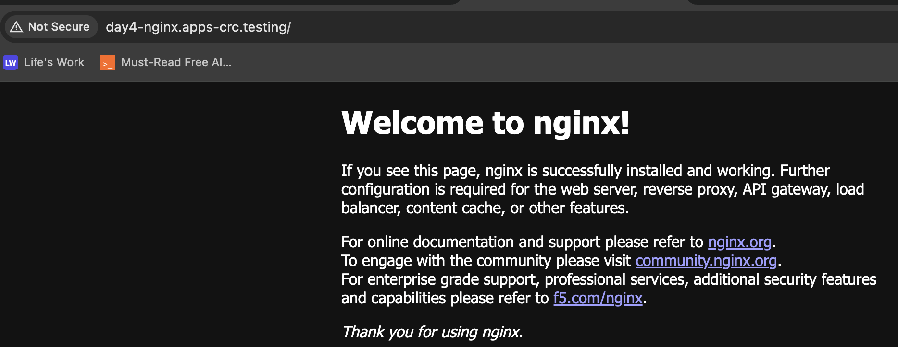

## Day 4 — Deploying NGINX and Understanding Routes & Services

**Goal:** Deploy an NGINX application on OpenShift CRC, learn how Routes and Services work together to expose it, and troubleshoot common platform issues (missing image registry, SCC restrictions).

---

### Step 1 — Create a Project and Deploy from Template

```sh
~$ oc new-project day4-nginx
Now using project "day4-nginx" on server "https://api.crc.testing:6443".

~$ oc new-app nginx-example
--> Success
    Access your application via route 'nginx-example-day4-nginx.apps-crc.testing'
```

> **Only for reference** — Full `oc new-app nginx-example` output:
> ```
> --> Deploying template "day4-nginx/nginx-example" to project day4-nginx
>
>      Nginx HTTP server and a reverse proxy
>      ---------
>      An example Nginx HTTP server and a reverse proxy (nginx) application that serves static content. For more information about using this template, including OpenShift considerations, see https://github.com/sclorg/nginx-ex/blob/master/README.md.
>
>      The following service(s) have been created in your project: nginx-example.
>
>      * With parameters:
>         * Name=nginx-example
>         * Namespace=openshift
>         * NGINX Version=1.20-ubi8
>         * Memory Limit=512Mi
>         * Git Repository URL=https://github.com/sclorg/nginx-ex.git
>         * Git Reference=
>         * Context Directory=
>         * Application Hostname=
>         * GitHub Webhook Secret=1YxiAvACYYigdIRPyl34hVNi8fsRKwMO1QDoXulM # generated
>         * Generic Webhook Secret=Mg5PLmch8BH07X4rKMYywBAcHOqLEYGFs6eaHaiF # generated
>
> --> Creating resources ...
>     service "nginx-example" created
>     route.route.openshift.io "nginx-example" created
>     imagestream.image.openshift.io "nginx-example" created
>     buildconfig.build.openshift.io "nginx-example" created
>     deployment.apps "nginx-example" created
> --> Success
>     Access your application via route 'nginx-example-day4-nginx.apps-crc.testing'
> ```

The template creates several resources:
| Resource | Purpose |
|----------|---------|
| `Deployment` | Runs the NGINX container |
| `Service` | Internal cluster networking on port 8080 |
| `Route` | External HTTP access via a hostname |
| `BuildConfig` | Source-to-image (S2I) build pipeline |
| `ImageStream` | Tracks container image versions |

---

### Step 2 — Template Troubleshooting: No Image Registry

The template's S2I build cannot complete because CRC has no integrated container image registry:

```sh
~$ oc logs -f buildconfig/nginx-example
error: no builds found for "nginx-example"

~$ oc status
Errors:
  * bc/nginx-example is pushing to istag/nginx-example:latest, but the administrator
    has not configured the integrated container image registry.

~$ oc get all
```

> **Only for reference** — Full `oc status --suggest` output:
> ```
> Errors:
>   * bc/nginx-example is pushing to istag/nginx-example:latest, but the administrator has not configured the integrated container image registry.
>     try: oc registry -h
> Warnings:
>   * istag/nginx-example:latest needs to be imported or created by a build.
>     try: oc start-build nginx-example
> ```
>
> **Only for reference** — Full `oc get all` output:
> ```
> NAME                    TYPE        CLUSTER-IP     EXTERNAL-IP   PORT(S)    AGE
> service/nginx-example   ClusterIP   10.217.4.190   <none>        8080/TCP   2m22s
>
> NAME                            READY   UP-TO-DATE   AVAILABLE   AGE
> deployment.apps/nginx-example   0/1     0            0           2m22s
>
> NAME                                       DESIRED   CURRENT   READY   AGE
> replicaset.apps/nginx-example-69984c487c   1         0         0       2m22s
>
> NAME                                           IMAGE REPOSITORY   TAGS   UPDATED
> imagestream.image.openshift.io/nginx-example
>
> NAME                                     HOST/PORT                                   PATH   SERVICES        PORT    TERMINATION   WILDCARD
> route.route.openshift.io/nginx-example   nginx-example-day4-nginx.apps-crc.testing          nginx-example   <all>                 None
> ```

Notice all pods are at `0/1` — the deployment cannot start because no image was ever built.

**Workaround:** Bypass the S2I pipeline by pointing the deployment directly to a public image.

---

### Step 3 — Switch to a Public Image (Bitnami NGINX)

```sh
~$ oc set image deploy/nginx-example nginx-example=bitnami/nginx:sha256-cdf9e347e44ecd304efb7ce5e1802f3f0ebf1d8eb52efdf1315576f95ce13915
deployment.apps/nginx-example image updated

~$ oc get pods
NAME                             READY   STATUS                 RESTARTS   AGE
nginx-example-57f448b887-qvjfd   0/1     CreateContainerError   0          70s
```

The pod fails with `CreateContainerError`. Let's investigate:

> **Only for reference** — Full `oc describe pod` output:
> ```
> Events:
>   Type     Reason          Age               From               Message
>   ----     ------          ----              ----               -------
>   Normal   Scheduled       81s               default-scheduler  Successfully assigned day4-nginx/nginx-example-57f448b887-qvjfd to crc
>   Normal   AddedInterface  80s               multus             Add eth0 [10.217.0.20/23] from ovn-kubernetes
>   Normal   Pulling         80s               kubelet            Pulling image "bitnami/nginx:sha256-cdf9e347e44ecd304efb7ce5e1802f3f0ebf1d8eb52efdf1315576f95ce13915"
>   Normal   Pulled          70s               kubelet            Successfully pulled image "bitnami/nginx:sha256-cdf9e347e44ecd304efb7ce5e1802f3f0ebf1d8eb52efdf1315576f95ce13915" in 10.218s (10.218s including waiting). Image size: 7948 bytes.
>   Warning  Failed          70s               kubelet            Error: reference "[overlay@/var/lib/containers/storage+/run/containers/storage:overlay.skip_mount_home=true]docker.io/bitnami/nginx@sha256:4f1850ca2bb183d4a24c2be40fc983c1e4e3bf83543bbfa8bc42e618340db5a8" does not resolve to an image ID
>   Normal   Pulled          5s (x6 over 70s)  kubelet            Container image "bitnami/nginx:sha256-cdf9e347e44ecd304efb7ce5e1802f3f0ebf1d8eb52efdf1315576f95ce13915" already present on machine
>   Warning  Failed          5s (x6 over 70s)  kubelet            Error: reading image "010a981ff7bfa8416bac963b62ec8eaf862c54d6cac54a1d6b2141f2e94b0717": locating image with ID "010a981ff7bfa8416bac963b62ec8eaf862c54d6cac54a1d6b2141f2e94b0717": image not known
> ```

**Root Cause:** The `skip_mount_home=true` option in the container runtime (CRI-O / Podman) prevents the image from being properly resolved on disk. The pod cannot start with the overridden image.

### Step 3a — Fix with SCC (Security Context Constraints)

OpenShift's default restricted SCC prevents containers from running as root. The Bitnami NGINX image expects to run as a non-root user but encounters storage issues. Grant the `anyuid` SCC to the default service account so containers can run with any user ID:

```sh
~$ oc adm policy add-scc-to-user anyuid -z default -n day4-nginx
clusterrole.rbac.authorization.k8s.io/system:openshift:scc:anyuid added: "default"
```

---

### Step 4 — Deploy Bitnami NGINX via Declarative YAML

Instead of patching the template's deployment, create a fresh Deployment and Service:

<details>
<summary><strong>bitnami-nginx.yaml</strong> — Deployment & Service</summary>

```yaml
apiVersion: apps/v1
kind: Deployment
metadata:
  name: bitnami-nginx-app
  namespace: day4-nginx
spec:
  replicas: 1
  selector:
    matchLabels:
      app: bitnami-nginx
  template:
    metadata:
      labels:
        app: bitnami-nginx
    spec:
      containers:
      - name: nginx
        image: bitnami/nginx:latest
        ports:
        - containerPort: 8080
---
apiVersion: v1
kind: Service
metadata:
  name: nginx-service
  namespace: day4-nginx
spec:
  ports:
  - port: 8080
    targetPort: 8080
  selector:
    app: bitnami-nginx
```
</details>

Apply and verify:

```sh
~/day4$ oc apply -f bitnami-nginx.yaml

~/day4$ oc get pods
NAME                                 READY   STATUS    RESTARTS   AGE
bitnami-nginx-app-6cbd4d7f64-6mzdh   1/1     Running   0          25s

~/day4$ oc logs bitnami-nginx-app-6cbd4d7f64-6mzdh --tail 10
nginx 08:53:19.88 INFO  ==> ** NGINX setup finished! **
nginx 08:53:19.90 INFO  ==> ** Starting NGINX **
```

The pod is now **Running**. But there is no Route pointing to the new Service.

---

### Step 5 — Create a Route for External Access

The default Route created by the template still points to the old `nginx-example` Service. We need a new Route for our `nginx-service`:

```yaml
apiVersion: route.openshift.io/v1
kind: Route
metadata:
  name: nginx-route
  namespace: day4-nginx
spec:
  host: day4-nginx.apps-crc.testing
  to:
    kind: Service
    name: nginx-service
  port:
    targetPort: 8080
```

Verify the Route was created:

```sh
~/day4$ oc get routes
NAME           HOST/PORT                     PATH   SERVICES        PORT    TERMINATION   WILDCARD
nginx-example  nginx-example-day4-nginx.apps-crc.testing   nginx-example   <all>                 None
nginx-route    day4-nginx.apps-crc.testing                 nginx-service   8080                  None
```

---

### Step 6 — Verify End-to-End Connectivity

From the Ubuntu VM (CRC host):

```sh
~/day4$ curl -k http://day4-nginx.apps-crc.testing
<!DOCTYPE html>
<html>
<head>
<title>Welcome to nginx!</title>
...
<p><em>Thank you for using nginx.</em></p>
</body>
</html>
```

From your laptop browser:



---

### Architecture Summary

```
┌──────────────┐       ┌─────────────┐       ┌──────────────┐       ┌──────────────────┐
│   Laptop     │ ──►   │ OpenShift   │ ──►   │ nginx-service│ ──►   │ bitnami-nginx-app│
│  :50181      │       │ Router:80   │       │  ClusterIP   │       │  Pod :8080       │
└──────────────┘       └─────────────┘       └──────────────┘       └──────────────────┘
   HTTP GET                  │                    │                        │
   day4-nginx.apps-crc       │                    │                        │
   .testing                  ▼                    ▼                        ▼
                        Route               Service                  Deployment
                     (nginx-route)       (nginx-service)           (1 replica)
```

1. **Route** receives the HTTP request on the host VM (port 80).
2. **Route** forwards to the **Service** (`nginx-service`).
3. **Service** load-balances to the **Pod** (`bitnami-nginx-app`) on port 8080.
4. Response flows back through the same path.

---

### Key Takeaways for Platform Engineers

| Concept | Description |
|---------|-------------|
| **Route** | OpenShift's ingress resource — maps a DNS hostname to a Service. Unlike plain Kubernetes Ingress, it supports TLS termination, path rewriting, and session affinity natively. |
| **Service** | Stable internal IP (ClusterIP) and DNS name for a set of pods. In this setup, it bridges the Route (L7) to the Pod (L4). |
| **SCC (anyuid)** | OpenShift's security mechanism. By default, containers run with a random UID. The `anyuid` SCC lifts this restriction — use sparingly and only when the image requires it. |
| **Image Registry** | CRC has no integrated registry by default. S2I builds that push to an ImageStream will fail. Workaround: use pre-built public images or configure an external registry. |
| **skip_mount_home** | CRI-O specific option. When `skip_mount_home=true`, certain image layer lookups can fail — a known CRC edge case with registry-qualified digest pulls. |

### Questions / Notes

- `skip_mount_home: true` — This is specific to underlying container runtimes like Podman or CRI-O. It prevents automatic mounting of the home directory into containers but can interfere with image ID resolution.

