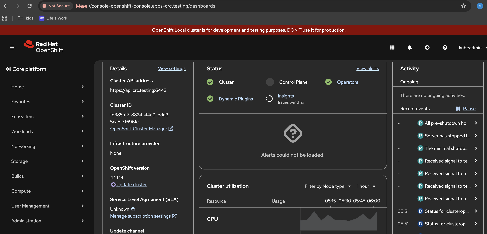

## Setup

### Hardware

- Mini PC
    - 16 x AMD Ryzen 7 PRO 5850U with Radeon Graphics (1 Socket)
    - 32 GB RAM
    - 1 TB Storage

### Software

- Proxmox 9.1.1
- Ubuntu Server 24.04 LTS
    - 8 Core using host configuration
    - 23 GB RAM (max available for consumption after Proxmox resource consumption)
- Openshift Single Node using crc (Code Ready Containers) inside Ubuntu VM- HAProxy to route traffic from internal network

### Considerations

#### Deploying OpenShift inside Ubuntu VM

We can install OpenShift on baremetal server. Both Proxmox and Openshift consume complete infrastructure available and cannot use dual boot. As the mini pc would be used for multiple purpose, the option was to use proxmox as base OS for the mini PC and setup openshift in a VM. 

#### Updating host file

The `/etc/hosts` file on local machine needs to be updated as below

# Added by CRC
127.0.0.1        api.crc.testing canary-openshift-ingress-canary.apps-crc.testing console-openshift-console.apps-crc.testing default-route-openshift-image-registry.apps-crc.testing downloads-openshift-console.apps-crc.testing host.crc.testing oauth-openshift.apps-crc.testing
# End of CRC section

### Start OpenShift

The command `crc setup` would be used to setup openshift on single node. The required binary is downloaded from RedHat portal after signing up as Developer.

Then `crc start` command is used to start the node.

```sh
# crc start
INFO Using bundle path /home/gopi/.crc/cache/crc_libvirt_4.21.14_amd64.crcbundle
INFO Checking if running as non-root
INFO Checking if running inside WSL2
INFO Checking if crc-admin-helper executable is cached
INFO Checking if running on a supported CPU architecture
INFO Checking if crc executable symlink exists
INFO Checking minimum RAM requirements
INFO Checking if Virtualization is enabled
INFO Checking if KVM is enabled
INFO Checking if libvirt is installed
INFO Checking if user is part of libvirt group
INFO Checking if active user/process is currently part of the libvirt group
INFO Checking if libvirt daemon is running
INFO Checking if a supported libvirt version is installed
INFO Checking if crc-driver-libvirt is installed
INFO Checking crc daemon systemd socket units
INFO Checking if AppArmor is configured
INFO Checking if vsock is correctly configured
INFO Loading bundle: crc_libvirt_4.21.14_amd64...
INFO Starting CRC VM for openshift 4.21.14...
INFO CRC instance is running with IP 127.0.0.1
INFO CRC VM is running
INFO Updating authorized keys...
INFO Configuring shared directories
INFO Check internal and public DNS query...
INFO Check DNS query from host...
INFO Verifying validity of the kubelet certificates...
INFO Starting kubelet service
INFO Waiting for kube-apiserver availability... [takes around 2min]
INFO Overriding password for developer user
ERRO ssh command error:
command : timeout 30s oc apply -f /opt/crc/routes-controller.yaml --context admin --cluster crc --kubeconfig /opt/kubeconfig
err     : Process exited with status 124
gopi@gopi-ubuntu:~$ crc start
INFO Loading bundle: crc_libvirt_4.21.14_amd64...
INFO A CRC VM for OpenShift 4.21.14 is already running
Started the OpenShift cluster.

The server is accessible via web console at:
  https://console-openshift-console.apps-crc.testing

Use the 'oc' command line interface:
  $ eval $(crc oc-env)
  $ oc login -u developer https://api.crc.testing:6443
```

Checking nodes and projects

```
~$ oc get nodes
NAME   STATUS   ROLES                         AGE   VERSION
crc    Ready    control-plane,master,worker   39d   v1.34.6

~$ oc projects
You have access to the following projects and can switch between them with ' project <projectname>':

  * default
    hostpath-provisioner
    kube-node-lease
    kube-public
    kube-system
    openshift
    openshift-apiserver
    openshift-apiserver-operator
    openshift-authentication
...
    openshift-ovn-kubernetes
    openshift-route-controller-manager
    openshift-service-ca
    openshift-service-ca-operator
    openshift-user-workload-monitoring
    openshift-vsphere-infra

Using project "default" on server "https://api.crc.testing:6443".
```

#### UI



### Questions

- How did CRC get a new IP in the random range 192.168.X.X that is not defined in the router configuration?
  CRC uses an internal host‑only network rather than your local router's DHCP, so this is completely normal and expected behavior.

- Why can't I use an IP to reach the OpenShift single node and use only a URL?
  OpenShift requires a URL (hostname) rather than a raw IP address because of its built-in Ingress controller, wildcard routing architecture, and strict security via TLS certificates. OpenShift routes do not map to physical node IPs; instead, they act as virtual host‑based routers.
